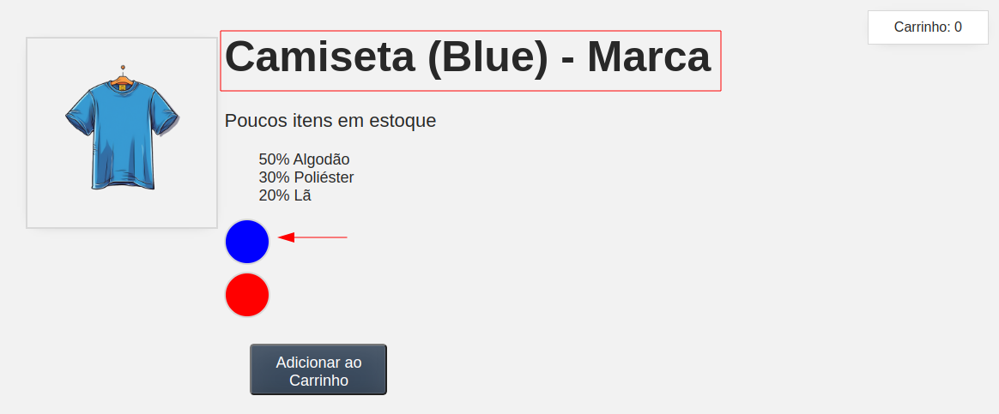
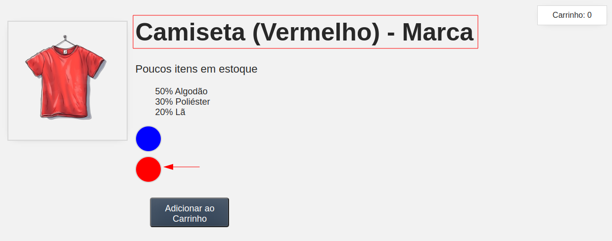
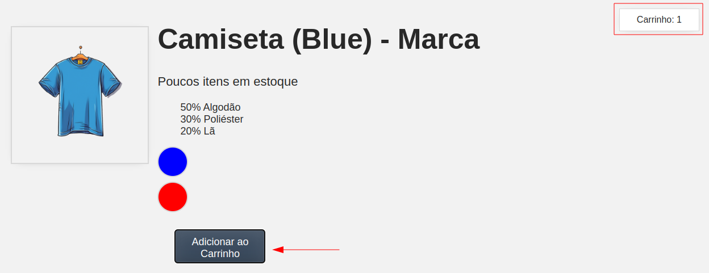

# Repositório de Estudo

Este repositório contém código desenvolvido unicamente para fins de estudo e revisão de conceitos do framework Vue.js, utilizando a abordagem via CDN para facilitar o uso.

## Propósito

O código presente aqui é destinado exclusivamente para a prática e relembrar conceitos. Ele não deve ser utilizado em ambientes de produção e não foi desenvolvido com a intenção de ser utilizado em projetos reais.

## Aviso

Este repositório é fornecido "como está".

## Contato

Se tiver alguma dúvida ou preocupação relacionada a este repositório, sinta-se à vontade para entrar em contato.

## Uso de Vue.js via CDN

Este projeto utiliza o Vue.js via CDN (Content Delivery Network) para facilitar o acesso e a execução do código. Não é necessário configurar um ambiente de desenvolvimento local, pois o Vue.js é importado diretamente nos arquivos HTML.

## Versão

No momento de criação desse repositório foi utilizado o Vue.js na versão 3 (3.4.21).

* [Vue.JS](https://vuejs.org)
* [Vue.JS - Releases](https://vuejs.org/about/releases.html)
* [Vue.Js - Introduction](https://vuejs.org/guide/introduction.html)
* [Vue.Js - Quick Start](https://vuejs.org/guide/quick-start.html)
* [VScode - Editor](https://code.visualstudio.com/)

## Demonstração das Telas

* Ao clicar no Botão azul muda a camiseta para cor azul e o nome.

* Ao clicar no Botão vermelho muda a camiseta para cor vermelhor e o nome.

Ao clicar no Botão Adicionar ao carrinho aumenta o número de itens do carrinho

